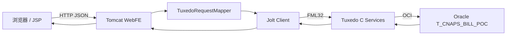

# CNAPS 凭证审核功能设计文档

> 文档版本：v1.0  
> 编写日期：2026-07-15  
> 设计状态：待评审  
> 对应需求：`docs/cnaps-review-requirements.md`  
> API 基线：`docs/cnaps-frontend-api.md` v0.5（以当前工作区内容为准）

## 1. 设计目标

本设计在不引入新前端框架、不改变现有 Java/Tuxedo/Oracle 技术栈的前提下，实现可编译、可测试、可完整部署的单级凭证审核功能。设计覆盖：

- JSP/JavaScript/CSS 审核页面和状态列表。
- Servlet 路由和 HTTP 契约。
- HTTP 与 Tuxedo 服务名、FML32 字段之间的映射。
- Mock 模式审核行为。
- Jolt 分页响应读取。
- Tuxedo C 待审核查询和审核状态变更。
- Oracle 乐观并发控制和审计字段。
- TUXCONFIG、Jolt metadata、测试、冒烟和部署。

本文档以当前 API 文档为唯一外部契约。项目中较早的数据库/API 说明仍包含审核意见、退回原因等历史设计，这些内容不作为本次实现依据。

## 2. 当前架构与基线差距

### 2.1 运行架构



本地或测试环境可将 Jolt Client 替换为 `MockTuxedoClient`，但 HTTP 契约和状态流转必须保持一致。

### 2.2 当前已具备能力

- 创建和修改后状态为 `10_PENDING_REVIEW`。
- `cnaps_status.h` 已定义四个有效状态。
- `cnaps_status_can_edit` 和 `cnaps_status_can_review` 已存在。
- 数据库表已有 `CHECKER_NO`、`CHECKER_TIME`、审计字段和 `VERSION_NO`。
- `db_update_voucher` 已使用 `BILL_ID + VERSION_NO` 进行乐观更新。
- `sql/050_enable_voucher_review.sql` 和迁移脚本已经能够清理历史 `00_DRAFT`。
- API 文档已定义审核列表、审核通过和审核退回。

### 2.3 当前缺口

| 层次 | 当前行为 | 本次设计 |
| --- | --- | --- |
| 页面 | 无审核页；查询输出原始 JSON | 新增结构化审核页和状态表格 |
| JavaScript | 只有健康、创建、通用查询 | 增加列表、分页、详情、通过、退回和统一错误处理 |
| Servlet | 三个审核 POST 返回 405 | 放行审核 POST，保留旧 GET 为 405 |
| 请求映射 | 无 `CNAPS5702Q/A/R` 映射 | 恢复三个服务映射 |
| Mock | 不支持审核服务 | 实现列表和两种审核动作 |
| Jolt | 不把审核列表识别为分页服务 | 将 `CNAPS5702Q` 加入分页读取 |
| C 服务 | 审核服务源文件已删除 | 恢复并按“无请求体”契约改造 |
| 服务注册 | Makefile、主程序、UBBCONFIG 无审核服务 | 注册三个审核服务 |
| Jolt metadata | 无审核服务定义 | 恢复三个定义，去除原因/意见输入 |
| 自动化测试 | 当前断言审核端点已移除 | 改为断言审核链路可用 |
| 冒烟测试 | 不覆盖审核 | 覆盖通过、退回及状态查询 |

## 3. 核心设计决策

### 3.1 保持单级审核

状态仍为待审核、审核通过、审核退回和已删除四种，不增加中间状态或多级审核字段。

### 3.2 审核接口无请求体

`review-pass` 和 `review-return` 仅依赖路径中的 `billId` 以及 WebFE 注入的操作员、机构和请求流水。前端不发送 `{}`，也不发送审核意见或退回原因。`JsonSupport.readBodyMap` 已支持 `Content-Length=0` 并返回空 Map，因此 Servlet 无需特殊解析器。

### 3.3 服务端状态为唯一真相

前端只在收到 `respCode=0000` 后提示成功，随后刷新列表。遇到超时或网络失败不自动重试副作用请求。服务端通过当前状态和 `VERSION_NO` 防止重复或并发审核。

### 3.4 审核页面只处理待审核记录

审核页调用专用 `review-list`，后端强制状态为 `10_PENDING_REVIEW`。全部状态由通用查询页展示，避免通过客户端参数绕过审核列表语义。

### 3.5 保留内部历史列，不公开历史输入字段

Oracle、FML 结构和 C 行结构可继续保留 `REVIEW_COMMENT`、`REJECT_REASON`、`DELETE_REASON`，避免破坏性 DDL 和二进制字段号变更。但本次审核服务不读取这些输入，公开 JSON 响应也不应依赖这些字段。

建议在 `TuxedoResponseMapper` 中建立内部字段排除集合，至少排除：

```text
REVIEW_COMMENT
REJECT_REASON
DELETE_REASON
```

同时从新增审核服务的 Jolt 输入定义中去除这些字段。若为了现有 Jolt 输出兼容仍传输这些字段，响应映射层也必须过滤，保证当前 `cnaps-frontend-api.md` 契约稳定。

## 4. 端到端接口映射

| HTTP 操作 | WebFE 路径 | Tuxedo 服务 | C 入口 | 成功目标 |
| --- | --- | --- | --- | --- |
| 待审核查询 | `POST /api/cnaps/vouchers/review-list` | `CNAPS5702Q` | `CNAPS5702Q` | 返回仅待审核分页记录 |
| 审核通过 | `POST /api/cnaps/vouchers/{billId}/review-pass` | `CNAPS5702A` | `CNAPS5702A` | `20_REVIEW_APPROVED` |
| 审核退回 | `POST /api/cnaps/vouchers/{billId}/review-return` | `CNAPS5702R` | `CNAPS5702R` | `30_REVIEW_REJECTED` |
| 凭证详情 | `GET /api/cnaps/vouchers/{billId}` | `CNAPS5702I` | `CNAPS5702I` | 返回服务端最终状态 |

`A` 表示 approve，`R` 表示 return，`Q` 表示 query。沿用这些已有传统服务名，避免重新分配服务号和修改外围配置约定。

## 5. 前端页面设计

### 5.1 文件设计

| 文件 | 类型 | 设计动作 |
| --- | --- | --- |
| `web-fe/src/main/webapp/cnaps-review.jsp` | 新增 | 审核查询、列表、分页、详情和确认对话框 |
| `web-fe/src/main/webapp/cnaps-query.jsp` | 修改 | 使用表格展示查询结果和状态 |
| `web-fe/src/main/webapp/index.jsp` | 修改 | 增加审核导航 |
| `web-fe/src/main/webapp/cnaps-create.jsp` | 修改 | 增加审核导航并标记当前页 |
| `web-fe/src/main/webapp/static/js/cnaps.js` | 修改 | 增加公共 API、列表和审核逻辑 |
| `web-fe/src/main/webapp/static/css/app.css` | 修改 | 表格、状态标签、分页、消息、详情和响应式样式 |

保持单个 JavaScript 和 CSS 文件，不引入 npm、Webpack 或第三方库，避免改变 WAR 构建流程。

### 5.2 页面结构

建议 `cnaps-review.jsp` 使用以下语义结构和 `data-*` 钩子：

```html
<body data-context-path="${pageContext.request.contextPath}">
  <main class="app-shell">
    <nav class="top-nav" aria-label="主导航">...</nav>
    <section class="workbench">
      <h1>审核处理</h1>
      <div data-page-message aria-live="polite"></div>
      <form data-review-query-form>...</form>
      <div data-list-summary></div>
      <div class="table-scroll">
        <table data-review-table>...</table>
      </div>
      <div data-review-empty hidden>暂无待审核凭证</div>
      <nav data-review-pagination aria-label="审核列表分页">...</nav>
    </section>
    <section data-voucher-detail hidden>...</section>
    <div data-confirm-dialog hidden role="dialog" aria-modal="true">...</div>
  </main>
</body>
```

不要求使用原生 `<dialog>`，以避免目标浏览器兼容性不确定。若使用自定义对话框，必须实现焦点进入、Escape 关闭、取消按钮和关闭后焦点恢复。

### 5.3 审核页面线框

```text
+------------------------------------------------------------------+
| 首页 | 录入 | 查询 | 审核                                         |
+------------------------------------------------------------------+
| 审核处理                                                         |
| [开始日期] [结束日期] [流水号] [每页10条 v] [查询] [重置]        |
| 共 25 条，第 1/3 页                                              |
|------------------------------------------------------------------|
| 凭证编号 | 工作日期 | 流水 | 收款人 | 金额 | 状态 | 操作         |
| B...     | 07-15    | ...  | 张三   | 100  | 待审核|详情 通过 退回|
|------------------------------------------------------------------|
| [上一页] 1 / 3 [下一页]                                         |
+------------------------------------------------------------------+
| 凭证详情（按需展开）                                             |
+------------------------------------------------------------------+
```

### 5.4 状态展示模型

JavaScript 中集中维护状态元数据，不得在多个页面重复硬编码：

```javascript
const voucherStatuses = Object.freeze({
  "10_PENDING_REVIEW": { label: "待审核", tone: "pending" },
  "20_REVIEW_APPROVED": { label: "审核通过", tone: "approved" },
  "30_REVIEW_REJECTED": { label: "审核退回", tone: "rejected" },
  "40_DELETED": { label: "已删除", tone: "deleted" }
});
```

渲染状态时创建两个文本节点：中文标签和原始状态码。未知值使用 `tone="unknown"`，不推断操作权限。

### 5.5 JavaScript 模块化结构

项目不使用 ES module 打包，仍在 `cnaps.js` 内组织纯函数和页面初始化函数：

```text
基础层
  contextPath()
  apiUrl(path)
  requestJson(path, options)
  showMessage(type, text)
  createTextCell(value)
  formatAmount(value)
  renderStatus(status)

列表层
  formToBody(form)
  normalizePage(data)
  renderVoucherRows(records, options)
  updatePagination(page)

页面层
  initHealthPage()
  initCreatePage()
  initQueryPage()
  initReviewPage()
```

`requestJson` 的建议行为：

1. 使用 `<body data-context-path>` 生成上下文相对 URL。
2. 仅当存在 JSON body 时设置 `Content-Type` 并执行 `JSON.stringify`。
3. 先读取响应文本，再尝试 JSON 解析，以便处理 Tomcat HTML 错误页。
4. 只有 HTTP 成功且 `respCode === "0000"` 才返回成功数据。
5. 抛出包含 `httpStatus`、`respCode`、`respMsg` 的结构化错误。
6. 不把 200 但 `respCode != 0000` 当作成功。

### 5.6 查询请求状态

审核页维护以下页面状态：

```javascript
const reviewState = {
  filters: { startWorkDate: "", endWorkDate: "", serialNo: "" },
  pageNo: 1,
  pageSize: 10,
  total: 0,
  records: [],
  querySequence: 0,
  busyBillIds: new Set()
};
```

- 每次查询递增 `querySequence`，响应返回时只有序号仍为最新才允许渲染。
- `busyBillIds` 防止同一凭证重复点击，但不阻塞其他行。
- 查询按钮和分页按钮在当前列表请求进行中禁用。

### 5.7 DOM 安全

所有来自 API 的值通过 `document.createTextNode`、`element.textContent` 或 `createTextCell` 渲染。禁止使用包含服务端值的模板字符串赋给 `innerHTML`。审核 URL 中的 `billId` 使用：

```javascript
encodeURIComponent(record.billId)
```

### 5.8 金额展示

API 金额为字符串。页面只做展示格式规范化，不进行业务计算：

- 合法的非负金额字符串按两位小数展示。
- 无法解析的值原样以纯文本展示并记录为未知格式。
- 不把金额转换后再传回服务端，避免 IEEE 754 精度问题。

### 5.9 审核动作流程

伪代码：

```javascript
async function reviewVoucher(record, action) {
  if (record.status !== "10_PENDING_REVIEW") return;
  const confirmed = await confirmReview(record, action);
  if (!confirmed || reviewState.busyBillIds.has(record.billId)) return;

  reviewState.busyBillIds.add(record.billId);
  renderRowBusy(record.billId, true);
  try {
    const suffix = action === "pass" ? "review-pass" : "review-return";
    await requestJson(
      `/api/cnaps/vouchers/${encodeURIComponent(record.billId)}/${suffix}`,
      { method: "POST" }
    );
    showMessage("success", action === "pass" ? "审核通过成功" : "审核退回成功");
    await reloadCurrentOrPreviousPage();
  } catch (error) {
    showReviewError(error);
    if (["3001", "3003", "3004"].includes(error.respCode)) {
      await loadReviewList();
    }
  } finally {
    reviewState.busyBillIds.delete(record.billId);
    renderRowBusy(record.billId, false);
  }
}
```

`4002` 或网络失败时只提示“结果可能未知，请刷新确认”，不自动调用同一个审核 POST；允许自动刷新只读列表。

## 6. WebFE Servlet 设计

### 6.1 `CnapsVoucherServlet`

修改路由判定：

```java
private static boolean isListPostPath(String apiPath) {
    return "/api/cnaps/vouchers/query".equals(apiPath)
        || "/api/cnaps/vouchers/review-list".equals(apiPath);
}

private static boolean isRejectedGetPath(String apiPath) {
    return "/api/cnaps/vouchers".equals(apiPath)
        || "/api/cnaps/vouchers/query".equals(apiPath)
        || "/api/cnaps/vouchers/review-list".equals(apiPath);
}
```

删除 `isRemovedReviewPath` 及 `doPost` 中的审核 405 分支。处理逻辑为：

- `review-list`：解析 JSON Map，执行与通用列表相同的日期范围校验，不调用 `includeBillPath`。
- `review-pass` / `review-return`：空 body 解析为空 Map，调用 `includeBillPath` 注入 `billId`。
- 旧 `GET /api/cnaps/vouchers/review-list`：继续返回 HTTP 405。

日期校验继续复用 `RequestSupport.validateWorkDateFilter`，保证两个列表接口行为一致。

### 6.2 错误映射

`BaseJsonServlet.httpStatus` 已满足当前审核错误码：

- `3001` -> 404。
- `3003`、`3004` -> 409。
- `4002` -> 504。
- `4003` -> 503。

无需新增 HTTP 状态映射。若审核服务出现未识别错误码，仍由默认分支返回 500。

## 7. Tuxedo 请求映射设计

### 7.1 `TuxedoRequestMapper.serviceName`

在通用查询判断之后、凭证详情通配判断之前增加：

```java
if ("POST".equals(verb) && "/api/cnaps/vouchers/review-list".equals(cleanPath)) {
    return "CNAPS5702Q";
}
```

在 `/api/cnaps/vouchers/` 子路径判断中增加：

```java
if ("POST".equals(verb) && cleanPath.endsWith("/review-pass")) {
    return "CNAPS5702A";
}
if ("POST".equals(verb) && cleanPath.endsWith("/review-return")) {
    return "CNAPS5702R";
}
```

审核动作判断必须与 `/delete` 同级；GET 详情判断必须排除集合路径，防止把 `review-list` 当成 `billId`。

### 7.2 字段映射

待审核列表使用现有 camelCase 自动转换或显式映射：

| JSON | FML32 |
| --- | --- |
| `startWorkDate` | `START_WORK_DATE` |
| `endWorkDate` | `END_WORK_DATE` |
| `serialNo` | `SERIAL_NO` |
| `pageNo` | `PAGE_NO` |
| `pageSize` | `PAGE_SIZE` |

审核动作只传：

- 路径注入的 `BILL_ID`。
- WebFE 生成的 `REQUEST_ID` / `REQ_ID`。
- WebFE 配置的 `OPERATOR_NO`。
- WebFE 配置的 `BRANCH_NO`。

删除 `rejectReason`、`reviewComment`、`deleteReason` 的公开 body 映射，以与当前 API 文档的无请求体契约保持一致。内部 FML 常量可保留。

## 8. Mock 客户端设计

### 8.1 服务分派

`MockTuxedoClient.call` 中：

- 将 `CNAPS5702Q` 加入工作日期范围校验。
- `CNAPS5702Q` 返回 `voucherPage(request, "10_PENDING_REVIEW")`。
- `CNAPS5702A` 调用 `reviewPass`。
- `CNAPS5702R` 调用 `reviewReturn`。

### 8.2 状态变更

两个动作共享私有方法，区别仅为目标状态、最后动作和消息：

```text
CNAPS5702A -> 20_REVIEW_APPROVED / REVIEW_PASS
CNAPS5702R -> 30_REVIEW_REJECTED / REVIEW_RETURN
```

共享流程：

1. 按 `BILL_ID` 查找记录，不存在返回 `3001`。
2. 对单张凭证对象加同步锁，保证 Mock 并发测试中状态检查和修改不可分割。
3. 非 `10_PENDING_REVIEW` 返回 `3004`。
4. 写入目标状态、审核员、审核时间、最后动作。
5. 移除历史 `REVIEW_COMMENT` 和 `REJECT_REASON`。
6. `VERSION_NO + 1`。
7. 调用 `touch` 更新最后请求、操作员和时间。
8. 返回更新后的凭证。

Mock 不得要求 `REJECT_REASON`，否则会与 HTTP API 和真实服务不一致。

## 9. Jolt 客户端设计

### 9.1 分页服务识别

修改 `JoltTuxedoClient`：

```java
private static final List<String> PAGE_SERVICES =
    List.of("BANKQRY", "CNAPS4609Q", "CNAPS5702Q");

private static final List<String> OPERATOR_NO_OUTPUT_ONLY_SERVICES =
    List.of("CNAPS4609Q", "CNAPS5702Q");
```

原因：

- `CNAPS5702Q` 使用与通用查询相同的重复 FML occurrence 分页响应。
- 审核列表中的 `OPERATOR_NO` 是输出记录字段，不是查询过滤条件；WebFE 不应向 Jolt 的输出字段写固定操作员号。

### 9.2 响应读取

`readResponseFields` 现有分页分支可直接复用：

- `PAGE_NO`、`PAGE_SIZE`、`TOTAL_ELEMENTS` 映射到分页对象。
- 以 `BILL_ID` 作为 occurrence 主字段。
- 读取上限取 `min(pageSize, total, 1000)`。
- WebFE 对外映射为 `pageNo`、`pageSize`、`total`、`records`。

审核列表实际最大页大小由 C 服务限制为 100，因此不会触及 Jolt 的 1000 occurrence 安全上限。

## 10. Tuxedo C 服务设计

### 10.1 待审核查询 `CNAPS5702Q`

在 `tuxedo-server/src/services/cnaps_query.c` 中恢复 `CNAPS5702Q`，并复用现有查询基础设施：

输入：

- `START_WORK_DATE`。
- `END_WORK_DATE`。
- `BRANCH_NO`，由 WebFE 注入。
- `SERIAL_NO`。
- `PAGE_NO`、`PAGE_SIZE`。

固定参数：

- `status = CNAPS_STATUS_PENDING_REVIEW`。
- `voucher_no = ""`。
- `payee_name = ""`。
- `payee_account_no = ""`。
- `include_deleted = 0`。

处理规则：

1. 用 513 字节临时缓冲读取原始日期，校验后再复制到 11 字节日期缓冲，避免截断后误判。
2. 日期可只传一端；两端都传时开始日期不得晚于结束日期。
3. `pageNo<=0` 使用 1。
4. `pageSize<=0` 使用 10；大于 100 截断为 100。
5. 调用现有 `db_query_vouchers`。
6. 使用 1 MiB 响应缓冲。
7. 输出 `PAGE_NO`、`PAGE_SIZE`、`TOTAL_ELEMENTS` 和重复凭证字段。

为减少通用查询和审核查询重复，可在 `cnaps_query.c` 内提取日期/分页解析私有函数；不得改变现有 `CNAPS4609Q` 的过滤语义。

### 10.2 审核服务源文件

新增 `tuxedo-server/src/services/cnaps_review.c`，导出：

```c
void CNAPS5702A(TPSVCINFO *rqst);
void CNAPS5702R(TPSVCINFO *rqst);
```

共享函数建议签名：

```c
static void review_voucher(
    TPSVCINFO *rqst,
    const char *service_name,
    const char *target_status,
    const char *action,
    const char *success_message
);
```

本次不再保留 `reject_required` 参数，也不读取 `REJECT_REASON` 或 `REVIEW_COMMENT`。

### 10.3 审核服务算法

```text
读取 BILL_ID
  为空 -> 2001
按 BILL_ID 查询凭证
  不存在 -> 3001
  DB 失败 -> 4001
检查 cnaps_status_can_review(row.status)
  否 -> 3004
读取 OPERATOR_NO、REQ_ID
设置 target status、action、checkerNo、lastOperatorNo、lastRequestId
清空 checkerTime（由数据库写 SYSTIMESTAMP）
清空 reviewComment、rejectReason
开启事务
按 BILL_ID + VERSION_NO 乐观更新
  影响 0 行 -> rollback -> 3004
  DB 失败 -> rollback -> 4001
重新查询更新后记录
提交
输出凭证与 0000
```

审核状态冲突统一返回 `3004`，不返回 `3003`。`3003` 继续用于修改、删除等一般状态不允许场景。

### 10.4 审核时间

当前 `db_update_voucher` 的 `CHECKER_TIME` 逻辑只会把空值写为 NULL。审核服务若将 `checker_time` 留空，将导致审核成功却没有审核时间。必须恢复动作感知逻辑：

```sql
CHECKER_TIME = CASE
  WHEN :last_action IN ('REVIEW_PASS', 'REVIEW_RETURN') THEN SYSTIMESTAMP
  WHEN :checker_time IS NULL THEN NULL
  ELSE TO_TIMESTAMP(:checker_time, 'YYYY-MM-DD HH24:MI:SS')
END
```

这样审核时间使用 Oracle 服务器时间，与 `UPDATED_AT` 和 `LAST_ACTION_TIME` 同一时间源。修改退回凭证时现有逻辑会清空 `checker_time`，对应数据库写 NULL。

### 10.5 乐观并发

`db_update_voucher` 当前更新条件为：

```sql
WHERE BILL_ID = :bill_id
  AND NVL(VERSION_NO, 1) = :version_no
```

两个审核请求读取相同版本时，只有第一个更新成功；第二个更新影响 0 行并返回 `3004`。所有应用状态变更必须继续递增 `VERSION_NO`，不得绕过该函数直接更新状态而不增版本。

## 11. 服务注册与元数据设计

### 11.1 C 主程序和构建

修改 `tuxedo-server/src/cnapspocsvr.c`，增加三个服务声明。修改 `tuxedo-server/Makefile`：

```make
SERVICES := ... CNAPS4609Q CNAPS5702Q CNAPS5702I CNAPS5702A CNAPS5702R
```

`SOURCES` 已使用 `$(wildcard src/services/*.c)`，新增 `cnaps_review.c` 会自动参与编译，无需单独列源文件。

### 11.2 UBBCONFIG

在 `tuxedo/UBBCONFIG` 的 `*SERVICES` 增加：

```text
CNAPS5702Q
CNAPS5702A
CNAPS5702R
```

无需增加新 server process，三个服务由现有 `cnapspocsvr` 提供。

### 11.3 Jolt metadata

在 `tuxedo/jolt/cnaps_services.bulk` 增加三个 `service=` 块。

`CNAPS5702Q`：

- 输入：日期范围、机构号、流水号、分页参数。
- 输出：分页元数据和列表记录字段。
- 列表字段使用 `count=0` 表示重复 occurrence。
- `PAYER_ADDRESS`、`PAYEE_ADDRESS`、`PAYER_BANK_NAME` 仍为详情专用字段，不加入列表。

`CNAPS5702A` / `CNAPS5702R`：

- 输入：`REQUEST_ID`、`REQ_ID`、`BILL_ID`、`BRANCH_NO`、`OPERATOR_NO`。
- 输出：`RESP_CODE`、`RESP_MSG` 以及当前 API 允许的凭证结果字段。
- 不定义 `REVIEW_COMMENT` 或 `REJECT_REASON` 为输入。
- `RESP_CODE`、`RESP_MSG` 必须使用 `outerr`，保证 TPFAIL 时 Jolt 仍可读取业务错误。

`scripts/load-jolt-metadata.sh` 当前在加载前执行：

```text
tmloadrepos -d CNAPS5702Q,CNAPS5702A,CNAPS5702R ...
```

该删除步骤可以保留，作用是先清理可能存在的旧定义，再由随后生成的完整 metadata 重新加载新定义。测试应从“永久清除已退役服务”调整为“删除旧定义后重新加载当前定义”。

## 12. 数据库与数据设计

### 12.1 表结构

不新增表或列，继续使用 `T_CNAPS_BILL_POC`：

| 字段 | 审核用途 |
| --- | --- |
| `STATUS` | 当前凭证状态 |
| `CHECKER_NO` | 最近审核操作员 |
| `CHECKER_TIME` | 最近审核时间 |
| `LAST_ACTION` | `REVIEW_PASS` 或 `REVIEW_RETURN` |
| `LAST_OPERATOR_NO` | 最后操作员 |
| `LAST_REQUEST_ID` | WebFE 生成的请求流水 |
| `LAST_ACTION_TIME` | 最后动作时间 |
| `UPDATED_AT` | 最后更新时间 |
| `VERSION_NO` | 乐观锁版本 |

### 12.2 字段写入矩阵

| 动作 | STATUS | CHECKER_NO/TIME | LAST_ACTION | VERSION_NO |
| --- | --- | --- | --- | --- |
| 创建 | `10_PENDING_REVIEW` | 空 | `CREATE` | 1 |
| 审核通过 | `20_REVIEW_APPROVED` | 写入 | `REVIEW_PASS` | +1 |
| 审核退回 | `30_REVIEW_REJECTED` | 写入 | `REVIEW_RETURN` | +1 |
| 退回后修改 | `10_PENDING_REVIEW` | 清空 | `UPDATE` | +1 |
| 删除 | `40_DELETED` | 保持现有语义 | `DELETE` | +1 |

### 12.3 历史状态迁移

本功能本身不新增迁移文件。上线前使用现有：

```text
scripts/migrate-voucher-review.sh
sql/050_enable_voucher_review.sql
```

迁移脚本幂等地将 `00_DRAFT` 改为 `10_PENDING_REVIEW`。首次发布该状态体系时必须在停机维护窗口执行；已经完成迁移的环境不需要重复停机迁移，但可通过只读 SQL 先确认：

```sql
SELECT STATUS, COUNT(*)
FROM T_CNAPS_BILL_POC
GROUP BY STATUS
ORDER BY STATUS;
```

不得在文档、脚本输出或提交中暴露 `conf/db.env` 内容。

## 13. 返回与错误设计

### 13.1 成功返回

保持统一 envelope：

```json
{
  "respCode": "0000",
  "respMsg": "审核通过成功",
  "data": {
    "billId": "B202607157720002000",
    "status": "20_REVIEW_APPROVED",
    "checkerNo": "77210021",
    "checkerTime": "2026-07-15 10:30:00",
    "lastAction": "REVIEW_PASS",
    "versionNo": 2
  }
}
```

页面只强依赖 `respCode` 和刷新后的服务端数据。动作响应中的 `data` 可包含更多当前 API 公开字段，但不得要求前端从动作响应本地拼装最终列表。

### 13.2 错误返回

| C 服务场景 | respCode | WebFE HTTP |
| --- | --- | --- |
| 缺少 `billId` | `2001` | 400 |
| 凭证不存在 | `3001` | 404 |
| 非待审核或乐观锁失败 | `3004` | 409 |
| 数据库失败 | `4001` | 500 |
| Jolt/Tuxedo 超时 | `4002` | 504 |
| Tuxedo 不可用 | `4003` | 503 |

错误返回的 `data` 必须为 `null`。前端优先显示 `respMsg`，但应为无消息或非 JSON 响应提供本地兜底文案。

## 14. 测试设计

### 14.1 WebFE 路由测试

修改 `BaseJsonServletTest`：

- `doesNotDefaultDateFilterForVoucherCollections` 同时覆盖 `query` 和 `review-list`。
- 日期范围转发、空白范围清理、非法日期和退役 `workDate` 校验同时覆盖两个 POST 列表。
- GET 405 测试继续覆盖 `review-list`。
- 删除“审核 POST 被移除”的断言。
- 新增审核通过/退回空 body 能调用 Tuxedo、正确注入 `BILL_ID`、`OPERATOR_NO`、`BRANCH_NO`、`REQ_ID` 的测试。

### 14.2 请求映射测试

修改 `TuxedoRequestMapperTest`：

- `review-list -> CNAPS5702Q`。
- `review-pass -> CNAPS5702A`。
- `review-return -> CNAPS5702R`。
- GET 列表仍被拒绝。
- 审核请求不产生 `REJECT_REASON`、`REVIEW_COMMENT`、客户端操作员或客户端机构字段。

### 14.3 Mock 契约测试

修改 `MockTuxedoClientV03ContractTest` 并增加：

1. 审核列表只返回待审核记录。
2. 审核列表日期范围、流水号和分页正确。
3. 审核通过完整审计字段和版本号正确。
4. 审核退回不要求原因并正确改变状态。
5. 非待审核状态返回 `3004`。
6. 不存在记录返回 `3001`。
7. 退回后修改重新进入待审核并清空审核字段。
8. 同一操作员可创建并审核同一凭证，符合 POC 限制。
9. 两线程并发通过/退回时只有一个 `0000`，另一个 `3004`。

### 14.4 Jolt 客户端测试

修改 `JoltTuxedoClientTest` 和测试桩 `bea.jolt.JoltRemoteService`：

- `CNAPS5702Q` 被按分页服务解析。
- repeated fields 正确映射为 `records`。
- 查询请求不向 output-only 的 `OPERATOR_NO` 写值。
- `CNAPS5702A/R` 成功和 TPFAIL 错误 envelope 可读取。
- `VERSION_NO` 仍按数值读取。

### 14.5 原生 C 与部署制品契约测试

修改 `TuxedoCSourceContractTest`：

- `cnaps_review.c` 存在并导出两个动作。
- 使用 `cnaps_status_can_review`、`3004`、乐观更新和事务回滚。
- 不包含退回原因必填逻辑和 `3005` 本人审核限制。
- `db_helper.c` 审核动作将 `CHECKER_TIME` 写为 `SYSTIMESTAMP`。
- `CNAPS5702Q` 固定使用 `CNAPS_STATUS_PENDING_REVIEW`。

修改 `DeploymentArtifactTest`：

- `EXPORTED_SERVICES` 加入 `CNAPS5702Q/A/R`。
- Makefile、主 C 文件、UBBCONFIG 和 Jolt metadata 都包含三个服务。
- 审核列表的日期范围、分页、重复字段方向正确。
- 审核动作的 `BILL_ID`、上下文字段和 envelope 方向正确。
- 审核动作 metadata 不把原因/意见定义为输入。
- 更新 `load-jolt-metadata.sh` 断言，允许先删除旧定义再加载当前定义。

### 14.6 前端手工测试

当前项目没有浏览器测试框架。本期至少执行：

- 页面首次加载、查询、重置、翻页、空数据。
- 查看详情打开和关闭。
- 通过和退回的确认/取消。
- 双击按钮只能发出一次请求。
- `3004` 并发提示和刷新。
- 长文本、中文、HTML 特殊字符不破坏页面。
- 1280px 桌面和窄屏水平滚动。
- 键盘 Tab、Enter、Escape 基本操作。

## 15. 冒烟测试设计

扩展 `scripts/smoke-test.sh`，不要只检查 HTTP 连接成功，还要检查 `respCode` 和最终状态。

建议流程：

```text
健康检查
创建凭证 A -> 10_PENDING_REVIEW
待审核列表能查到 A
审核通过 A -> 20_REVIEW_APPROVED
通用查询按 billId/状态或详情确认 A

创建凭证 B -> 10_PENDING_REVIEW
审核退回 B -> 30_REVIEW_REJECTED
详情确认 B
修改 B -> 10_PENDING_REVIEW
再次审核通过 B -> 20_REVIEW_APPROVED

创建凭证 C -> 删除 -> 40_DELETED
```

当前通用查询没有 `billId` 过滤条件，因此最终单据确认优先调用详情接口；列表状态校验可结合 `serialNo` 或创建响应中的字段。

审核 curl 示例：

```bash
curl -fsS -X POST "$BASE_URL/api/cnaps/vouchers/$bill_id/review-pass"
curl -fsS -X POST "$BASE_URL/api/cnaps/vouchers/$bill_id/review-return"
```

不要为无 body 请求添加虚构 JSON。脚本必须在响应不包含 `"respCode":"0000"` 或预期状态时退出非零。

## 16. 实施顺序

按以下顺序开发可以尽早发现契约和部署问题：

1. 更新测试期望，先增加请求映射、Mock 生命周期和 Servlet 路由测试。
2. 恢复 `TuxedoRequestMapper`、Servlet 和 Mock 服务，使 Maven 测试中的 HTTP/Mock 链路通过。
3. 恢复 `JoltTuxedoClient` 分页识别和 Jolt 测试。
4. 实现 `CNAPS5702Q` 和 `cnaps_review.c`，恢复审核时间数据库逻辑。
5. 更新 Makefile、主程序、UBBCONFIG 和 Jolt metadata。
6. 更新部署制品和 C 源码契约测试，运行完整 Maven 测试。
7. 实现审核 JSP、结构化查询列表、JavaScript 和 CSS。
8. 扩展冒烟脚本和运维说明。
9. 在 Linux/Tuxedo 环境执行 C 编译、metadata/TUXCONFIG 加载、WAR 构建和完整部署。
10. 执行真实 Jolt 模式端到端验收。

每一步都保持当前分支可编译；不要先提交只包含页面、但后端仍返回 405 的中间发布版本。

## 17. 变更文件清单

### 17.1 必须新增

```text
web-fe/src/main/webapp/cnaps-review.jsp
tuxedo-server/src/services/cnaps_review.c
```

### 17.2 必须修改

```text
web-fe/src/main/webapp/index.jsp
web-fe/src/main/webapp/cnaps-create.jsp
web-fe/src/main/webapp/cnaps-query.jsp
web-fe/src/main/webapp/static/js/cnaps.js
web-fe/src/main/webapp/static/css/app.css

web-fe/src/main/java/com/ruisui/cnaps/web/servlet/CnapsVoucherServlet.java
web-fe/src/main/java/com/ruisui/cnaps/web/tuxedo/TuxedoRequestMapper.java
web-fe/src/main/java/com/ruisui/cnaps/web/tuxedo/MockTuxedoClient.java
web-fe/src/main/java/com/ruisui/cnaps/web/tuxedo/JoltTuxedoClient.java
web-fe/src/main/java/com/ruisui/cnaps/web/tuxedo/TuxedoResponseMapper.java

tuxedo-server/Makefile
tuxedo-server/src/cnapspocsvr.c
tuxedo-server/src/services/cnaps_query.c
tuxedo-server/src/common/db_helper.c
tuxedo/UBBCONFIG
tuxedo/jolt/cnaps_services.bulk

scripts/smoke-test.sh
docs/cnaps-operations.md
```

### 17.3 必须更新的测试

```text
web-fe/src/test/java/com/ruisui/cnaps/web/servlet/BaseJsonServletTest.java
web-fe/src/test/java/com/ruisui/cnaps/web/tuxedo/TuxedoRequestMapperTest.java
web-fe/src/test/java/com/ruisui/cnaps/web/tuxedo/MockTuxedoClientV03ContractTest.java
web-fe/src/test/java/com/ruisui/cnaps/web/tuxedo/JoltTuxedoClientTest.java
web-fe/src/test/java/com/ruisui/cnaps/web/tuxedo/TuxedoCSourceContractTest.java
web-fe/src/test/java/com/ruisui/cnaps/web/tuxedo/DeploymentArtifactTest.java
web-fe/src/test/java/bea/jolt/JoltRemoteService.java
```

`tuxedo-server/include/cnaps_status.h` 和 `validation_helper.c` 已具备审核状态帮助函数，预计无需功能修改，但应由测试确认其实现未被移除。

## 18. 编译与验证

### 18.1 Windows/开发机可执行验证

```powershell
mvn -f web-fe/pom.xml clean package
```

预期：

- 所有 JUnit 测试通过。
- 生成 `web-fe/target/ruisui-bank-sim.war`。
- WAR 中包含 `cnaps-review.jsp`、更新后的 JavaScript 和 CSS。

### 18.2 Linux/Tuxedo 环境验证

```bash
./scripts/preflight.sh
./scripts/build-c.sh
./scripts/load-jolt-metadata.sh
./scripts/load-tuxconfig.sh
./scripts/build-web.sh
```

预期：

- `tuxedo-server/bin/cnapspocsvr` 链接成功。
- metadata repository 中存在 `CNAPS5702Q/A/R`。
- TUXCONFIG 加载成功。
- Maven 测试通过并生成 WAR。

### 18.3 完整部署

已完成历史状态迁移的环境：

```bash
cd /home/tian/cnaps-single-table-poc
./scripts/rebuild-deploy.sh
./scripts/cnapsctl.sh status
BASE_URL=http://127.0.0.1:8080/ruisui-bank-sim ./scripts/smoke-test.sh
```

首次淘汰 `00_DRAFT` 的环境：

```bash
cd /home/tian/cnaps-single-table-poc
./scripts/down.sh
sh ./scripts/migrate-voucher-review.sh
./scripts/rebuild-deploy.sh
./scripts/cnapsctl.sh status
BASE_URL=http://127.0.0.1:8080/ruisui-bank-sim ./scripts/smoke-test.sh
```

`rebuild-deploy` 的顺序应继续是：预检、停止服务、编译 C、加载 Jolt metadata、加载 TUXCONFIG、构建 WAR、部署 WAR、启动全链路、健康检查。

### 18.4 部署后检查

```bash
./scripts/status-tuxedo.sh
curl -fsS http://127.0.0.1:8080/ruisui-bank-sim/api/health
```

必须确认：

- Tuxedo 服务列表包含 `CNAPS5702Q`、`CNAPS5702A`、`CNAPS5702R`。
- 健康响应中 `oracle`、`tuxedo`、`webfe` 全部为 `UP`。
- 审核页可打开且静态资源无 404。
- 浏览器网络面板中审核动作请求路径包含正确上下文路径，无多余请求 body。

## 19. 发布与回滚

### 19.1 发布单元

以下制品必须作为同一版本发布：

- `cnapspocsvr` 原生服务二进制。
- TUXCONFIG 源配置。
- Jolt metadata repository 源文件及重新加载结果。
- `ruisui-bank-sim.war`。
- 冒烟脚本和运维文档。

只发布 WAR 会导致 Jolt 找不到审核服务；只发布 C 服务则页面和 WebFE 仍会返回 405。

### 19.2 回滚策略

1. 保留上一个版本的 WAR、C 二进制、UBBCONFIG 和 Jolt metadata 源文件。
2. 回滚时停止 Tomcat 和 Tuxedo，成套恢复四类制品，再重新加载 metadata 和 TUXCONFIG。
3. 审核产生的 `20_REVIEW_APPROVED`、`30_REVIEW_REJECTED` 数据不回滚、不改回 `00_DRAFT`。
4. 若上一个应用版本不识别审核状态，则不得直接应用回滚，必须先评估兼容补丁。
5. 数据迁移脚本没有反向迁移；禁止把已迁移记录改回已退役状态。

## 20. 风险与控制

| 风险 | 影响 | 控制措施 |
| --- | --- | --- |
| 只恢复 WebFE，未注册 Tuxedo 服务 | 运行时返回 `4003` | 部署制品契约测试和完整重建部署 |
| Jolt 把审核列表当单记录读取 | 列表为空或只显示一条 | 将 `CNAPS5702Q` 加入 `PAGE_SERVICES` 并做 occurrence 测试 |
| `CHECKER_TIME` 未写入 | 审计信息不完整 | 恢复 DB 动作感知时间逻辑并测试 |
| 两次并发审核都成功 | 状态和审计不确定 | `VERSION_NO` 乐观锁；Mock 同步；并发测试 |
| 超时后前端自动重试 | 重复副作用 | 审核 POST 不自动重试，只刷新确认 |
| API 文档与历史字段不一致 | 前后端依赖错误字段 | 当前 `cnaps-frontend-api.md` 为唯一外部契约，响应层过滤内部字段 |
| 旧 Jolt 定义残留 | 参数方向不一致 | 加载前删除旧服务定义，再加载完整新定义 |
| 页面直接拼接服务端文本 | XSS | DOM 文本渲染和 URL 编码 |
| 只替换 WAR | 审核不可用 | 原生服务、配置、metadata、WAR 成套发布 |

## 21. 开发完成检查表

- [ ] 审核页和全局导航完成。
- [ ] 审核列表、分页、状态和详情完成。
- [ ] 通过、退回确认及错误反馈完成。
- [ ] Servlet 放行审核 POST，旧 GET 仍为 405。
- [ ] `TuxedoRequestMapper` 三个服务映射完成。
- [ ] Mock 审核状态、审计、并发行为完成。
- [ ] Jolt 分页服务和 output-only 字段处理完成。
- [ ] `CNAPS5702Q/A/R` 原生服务完成。
- [ ] 审核时间和乐观锁验证完成。
- [ ] Makefile、主程序、UBBCONFIG、Jolt metadata 完成。
- [ ] API 不接收审核意见和退回原因。
- [ ] Maven 测试和 WAR 打包通过。
- [ ] Linux C 编译、metadata/TUXCONFIG 加载通过。
- [ ] 完整部署、健康检查和冒烟测试通过。
- [ ] 运维文档包含发布、验证和回滚说明。
